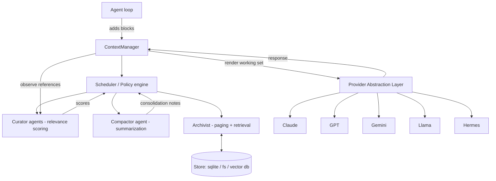

# LETHE — Engineering Design Document

**Live Ephemeral Token & History Engine**
A model-agnostic, multi-agent context garbage collector for long-running LLM agents.

> Status: design / pre-build · Target builder: Claude Code · Version: 0.1 (draft)
> Codename "Lethe" (the river of forgetting) — rename freely.

---

## 1. Problem statement

When an LLM agent runs a long task (tens to hundreds of steps — exactly what happens
inside Claude Code, Cowork, or any autonomous agent loop), its context window fills with
material that *was* useful but no longer is: stale tool outputs, files read 30 steps ago,
redundant intermediate results, dead reasoning branches.

This causes three concrete failures:

1. **Quality decay** — the "lost in the middle" effect: relevant tokens get buried under
   noise and the model's attention degrades.
2. **Cost growth** — every turn re-sends the entire bloated history; cost grows
   super-linearly with task length.
3. **Hard limits** — long tasks eventually hit the context ceiling and the agent breaks.

### What exists and why it is not enough
- **Prompt compression** (LLMLingua and variants) drops low-information tokens from a
  *single static prompt*. It is per-call and content-blind to the agent's evolving goal.
- **Agent memory** (Mem0, Zep, Letta, Cognee, MemGPT…) persists facts *across sessions*.
  It is not designed to manage the live, in-session working context of a running loop.

The gap LETHE fills: **autonomous, goal-aware management of the live agent context** —
deciding in real time what to keep, summarize, or page out, like virtual memory in an
operating system. This is the "Active Context Compression" direction emerging in 2026
agent research, packaged as a clean, provider-agnostic, plug-and-play library.

---

## 2. Goals and non-goals

### Goals
- **G1 — Provider-agnostic.** Works with Claude, GPT, Gemini, Llama, and Hermes through a
  single normalized interface. No provider lock-in.
- **G2 — Multi-agent core.** Internal work is split across specialized cheap sub-agents
  (Curator, Compactor, Archivist) and can use an *ensemble* of providers to vote on
  relevance decisions.
- **G3 — Lossless-by-default.** Nothing is destroyed. Evicted material is paged to an
  external store and can be rehydrated on demand (page fault).
- **G4 — Drop-in.** One-line `wrap()` around an existing agent, plus an MCP adapter for
  Claude Code.
- **G5 — Measurable.** Ships with an eval harness reporting token savings, task-success
  retention, and wrong-eviction rate.

### Non-goals (v1)
- Not a cross-session long-term memory product (compatible with one, not competing).
- Not a model-internal/KV-cache optimizer (we operate purely at the message/block level,
  black-box, no weights access).
- Not a fine-tuning project. The Curator is prompt-based first; learned scoring is a
  later, optional phase.

---

## 3. Core concepts

| Term | Meaning |
|---|---|
| **Block** | The atomic unit of context: one tool result, one file read, one assistant turn, one user message, one reasoning segment. |
| **Working set** | The blocks currently sent to the model on this turn (resident in the "physical memory" = context window). |
| **Page** | A block that has been evicted from the working set and written to the external store, leaving only a small **stub** behind. |
| **Stub** | A one-line placeholder kept in context: `[paged: read config.py @step12 · handle=a3f9]`. Lets the model and the Curator know the material exists and can be recalled. |
| **Page fault** | Re-loading a paged block into the working set because it became relevant again. |
| **Consolidation note** | A dense summary that replaces a run of completed steps, with provenance handles to the originals. |
| **Pin** | An explicit "never evict" mark (system prompt, current goal, hard constraints). |
| **Budget** | Target working-set size, expressed as a fraction of the model's context window (e.g. 0.6). |

### OS analogy (the mental model)
- context window = physical RAM
- external store = disk
- stub/handle = page-table entry
- rehydration = page-in on fault
- Curator = the pager's eviction policy
- Compactor = compression of cold pages
- Pinned blocks = wired/non-swappable memory

---

## 4. High-level architecture



Two layers do all the work:

- **Provider Abstraction Layer (PAL)** — normalizes messages, token counting, and
  completion calls across the five providers. Everything above PAL is provider-blind.
- **The GC core** — a Scheduler orchestrating three sub-agents (Curator, Compactor,
  Archivist) over a typed block store.

---

## 5. Provider Abstraction Layer (multi-provider)

The whole point of G1. A single interface; one adapter per provider.

### 5.1 Normalized types

```python
@dataclass
class Block:
    id: str
    role: Literal["system","user","assistant","tool","reasoning"]
    kind: Literal["text","tool_call","tool_result","file","image","note"]
    content: str | bytes
    created_step: int
    pinned: bool = False
    tokens: int | None = None          # filled by adapter
    refs: list[str] = field(default_factory=list)  # blocks this one cites
    meta: dict = field(default_factory=dict)        # path, tool name, handle...

@dataclass
class Message:           # provider-neutral
    role: str
    blocks: list[Block]
```

### 5.2 Adapter interface

```python
class ProviderAdapter(Protocol):
    name: str
    context_window: int                       # e.g. 200_000

    def count_tokens(self, blocks: list[Block]) -> int: ...
    def to_native(self, messages: list[Message]) -> Any: ...      # provider payload
    def complete(self, messages: list[Message], **kw) -> Response: ...
    def embed(self, text: str) -> list[float] | None: ...         # optional, for retrieval
```

### 5.3 Per-provider notes

| Provider | Completion API | Token counting | Embeddings | Serving |
|---|---|---|---|---|
| **Claude** | Anthropic Messages API | `count_tokens` endpoint | via separate embed provider | cloud |
| **GPT** | OpenAI Chat Completions / Responses | `tiktoken` | OpenAI embeddings | cloud |
| **Gemini** | Google GenAI | `count_tokens` method | Gemini embeddings | cloud |
| **Llama** | OpenAI-compatible (vLLM / Ollama / Together) | HF tokenizer for the model | HF / served embeddings | self-host or cloud |
| **Hermes** | OpenAI-compatible (Ollama / NousResearch endpoint) | HF tokenizer (Hermes base) | HF embeddings | self-host or cloud |

Design rules:
- Token counting must be **per-model accurate**, not approximate — eviction decisions
  depend on it. Maintain a tokenizer registry keyed by model id.
- Llama and Hermes share the OpenAI-compatible code path; they differ only in tokenizer
  and default endpoint, so they are config variants of one `OpenAICompatibleAdapter`.
- The adapter that runs the *agent* and the adapter(s) that run the *Curator/Compactor*
  are independent. You can run a Claude agent whose context is curated by a cheap Llama or
  Hermes model running locally — that is the cost play.

---

## 6. Multi-agent core

"Multi-agent" here means two things, both required:

1. **Internal division of labor** — three specialized sub-agents with narrow jobs.
2. **Cross-provider ensemble** — the Curator can poll several cheap models and aggregate.

### 6.1 Curator (relevance scoring)
Decides, for each non-pinned block, a relevance score `0..1` against the *current goal and
active sub-goal*. Two scoring modes, combinable:

- **Heuristic features (free, no model call):**
  - recency (steps since created)
  - reference count (was this block cited by later blocks? — strong keep signal)
  - block kind weights (a hard constraint > a verbose tool dump)
  - semantic similarity of the block to the active goal (via embeddings)
  - explicit pins → forced 1.0
- **Model judgment (cheap call):** a small model rates relevance to the stated objective.
- **Ensemble:** poll N cheap models across providers (e.g. Haiku + GPT-mini + Gemini Flash
  + Llama-8B + Hermes), aggregate by mean / median / trimmed-mean. Disagreement raises the
  block's "uncertainty," biasing toward *keep* (safe default).

Final score = weighted blend of heuristic and model signals (weights configurable).

### 6.2 Compactor (summarization)
When a contiguous run of *completed* low-score steps exists, the Compactor replaces them
with one **consolidation note**: a dense summary preserving decisions, results, and open
threads, plus handles to the originals (which are paged, not deleted). Guardrails:
- never compact across an unresolved sub-goal boundary
- never compact pinned blocks
- keep the note token cost well below the originals (or skip — no negative-savings compaction)

### 6.3 Archivist (paging + retrieval)
Owns the external store. Responsibilities:
- **page-out:** write block → store, compute embedding, leave a stub in context
- **retrieval:** on each turn, semantic-search the archive for blocks newly relevant to the
  current goal; surface candidates for page-in
- **page-fault:** when the model/agent references a handle, or a candidate scores high
  enough, rehydrate the block into the working set
- **provenance:** every consolidation note and stub resolves back to original bytes

### 6.4 Scheduler / Policy engine
The orchestrator. On a configurable trigger (budget exceeded, every K steps, or explicit
`compact()`), it runs: score → decide → compact → page, until the working set fits budget.
It is deterministic given scores, so behavior is testable and reproducible.

---

## 7. Block lifecycle (state machine)

```
            score < warm_threshold        run completed + score < cold
   ACTIVE  ───────────────────────►  WARM ───────────────────────────►  COMPACTED
     ▲                                                                      │
     │ page fault / high retrieval score                                    │ budget pressure
     │                                                                      ▼
     └──────────────────────  REHYDRATED  ◄───────── page fault ──────── PAGED (stub only)

PINNED blocks are excluded from this machine and always remain ACTIVE.
```

- **ACTIVE** — resident in working set.
- **WARM** — eligible but still resident; candidate for compaction.
- **COMPACTED** — represented by a consolidation note; detail lives in the store.
- **PAGED** — only a stub remains in context; full content in store.
- **REHYDRATED** — pulled back to ACTIVE after a fault.

---

## 8. Public API

### 8.1 Explicit integration (full control)

```python
from lethe import ContextManager
from lethe.adapters import AnthropicAdapter, OpenAICompatibleAdapter

cm = ContextManager(
    agent=AnthropicAdapter(model="claude-opus-4-8"),
    curator=OpenAICompatibleAdapter(model="hermes-4-8b", base_url="http://localhost:11434/v1"),
    budget=0.6,                       # keep working set < 60% of window
    store="sqlite:///./lethe.db",
    triggers={"every_steps": 5, "on_budget": True},
)

ctx = cm.session(goal="Refactor the auth module to use JWT")

ctx.add(block)                        # feed tool outputs / file reads / turns
working_set = ctx.render()            # compacted, provider-ready messages
response = cm.agent.complete(working_set)
ctx.observe(response)                 # records which handles/blocks were referenced
```

### 8.2 Transparent middleware (drop-in)

```python
from lethe import wrap

agent = wrap(my_existing_agent, budget=0.6, curator="ensemble")
# my_existing_agent's .complete() now auto-compacts before every call
```

`wrap()` intercepts the completion call, runs the GC pass, then forwards the compacted
working set. Existing agents get context management for free.

### 8.3 Key methods
- `ctx.add(block)` / `ctx.pin(block_id)` / `ctx.unpin(block_id)`
- `ctx.render() -> list[Message]`
- `ctx.recall(handle | query) -> Block` — manual page-in
- `ctx.stats() -> dict` — tokens saved, faults, evictions, scores
- `cm.session(goal, subgoal=None)`

---

## 9. MCP adapter for Claude Code

Ship an MCP server so LETHE plugs straight into Claude Code (and Cowork) — this is the
"Claude helps people install it" path.

Exposed tools:
- `lethe_status()` — current working-set size, budget, paged count
- `lethe_archive(reason)` — force a compaction pass now
- `lethe_recall(query | handle)` — page material back in
- `lethe_pin(block_id)` / `lethe_unpin(block_id)`

Plus an optional auto-compact hook that fires on the session's step events. Distribute a
ready-to-paste MCP config snippet in the README so setup is two commands.

---

## 10. Configuration

```yaml
lethe:
  budget: 0.6                 # fraction of context window for working set
  agent:    { provider: claude,  model: claude-opus-4-8 }
  curator:
    mode: ensemble            # heuristic | model | ensemble
    members:
      - { provider: claude,  model: claude-haiku-4-5 }
      - { provider: openai,  model: gpt-mini }
      - { provider: gemini,  model: gemini-flash }
      - { provider: llama,   model: llama-3-8b,  base_url: http://localhost:11434/v1 }
      - { provider: hermes,  model: hermes-4-8b, base_url: http://localhost:11434/v1 }
    aggregate: trimmed_mean
  compactor:  { provider: llama, model: llama-3-8b }
  store:      { backend: sqlite, path: ./lethe.db, vector: sqlite-vss }
  triggers:   { every_steps: 5, on_budget: true }
  thresholds: { warm: 0.45, cold: 0.25, fault_in: 0.7 }
  safety:     { keep_last_n_steps: 3, never_compact_open_subgoal: true }
```

---

## 11. Data model

```sql
-- blocks: every block ever seen, source of truth
CREATE TABLE blocks (
  id TEXT PRIMARY KEY, session TEXT, role TEXT, kind TEXT,
  content BLOB, created_step INT, pinned INT, tokens INT,
  state TEXT,                 -- ACTIVE|WARM|COMPACTED|PAGED
  handle TEXT, meta JSON
);
CREATE TABLE refs (src TEXT, dst TEXT);            -- citation graph
CREATE TABLE notes (id TEXT PRIMARY KEY, session TEXT,
  summary TEXT, covers JSON, tokens INT);          -- consolidation notes
CREATE VIRTUAL TABLE block_vec USING vss0(embedding(1024));  -- semantic retrieval
CREATE TABLE events (ts, session, kind, payload JSON);       -- audit / reproducibility
```

---

## 12. Evaluation plan

Without measurement this is a toy. Ship the harness from day one.

**Primary metrics**
- **Token reduction %** vs no-GC baseline, at equal task success.
- **Task-success retention** — does compaction hurt outcomes? (target: < 2% drop)
- **Wrong-eviction rate** — fraction of page faults that prove a block was evicted too
  early (caught when it has to be recalled within K steps).
- **Net savings** — token savings minus Curator/Compactor call cost. Must be positive.
- **Latency overhead** per turn.

**Test sets**
- **LoCoMo / long-conversation benchmarks** — recall after heavy compaction.
- **Long-horizon agent tasks** — SWE-style multi-file refactors, multi-step research.
- **Synthetic "needle in compacted haystack"** — plant a fact early, force compaction,
  query it 50 steps later; measure recall via page-fault.
- **Ablations** — heuristic-only vs single-model vs ensemble Curator; per-provider.

---

## 13. Repository structure

```
lethe/
  core/
    block.py            # Block, Message, lifecycle states
    manager.py          # ContextManager, session, render
    scheduler.py        # policy engine, triggers
    wrap.py             # transparent middleware
  agents/
    curator.py          # heuristic + model + ensemble scoring
    compactor.py        # consolidation notes
    archivist.py        # paging + retrieval + faults
  adapters/
    base.py             # ProviderAdapter protocol
    anthropic.py        # Claude
    openai.py           # GPT
    gemini.py           # Gemini
    openai_compatible.py# Llama + Hermes (config variants)
    tokenizers.py       # per-model token counting registry
  stores/
    sqlite.py  fs.py  memory.py  vector.py
  mcp/
    server.py           # Claude Code MCP adapter + config snippet
  evals/
    harness.py  benchmarks/  needle.py  report.py
  examples/
    claude_code_loop.py  multi_provider.py  transparent_wrap.py
  README.md  pyproject.toml
```

---

## 14. Build roadmap (for Claude Code)

Each phase is a shippable, testable milestone. Build in order.

- **Phase 0 — Scaffolding & PAL.** Repo, types, `ProviderAdapter`, all five adapters with
  accurate `count_tokens`. Acceptance: round-trip a conversation through each provider and
  match token counts within 1%.
- **Phase 1 — Manager + heuristic policy.** In-memory store, recency + pin + budget
  eviction, `render()`. No ML. Acceptance: a 100-step synthetic loop stays under budget.
- **Phase 2 — Curator (single model) + Compactor.** Model relevance scoring and
  consolidation notes. Acceptance: needle test passes with one cheap curator.
- **Phase 3 — Archivist + paging store.** SQLite + vector retrieval, stubs, page faults.
  Acceptance: evicted needle is recalled on demand; provenance resolves.
- **Phase 4 — Ensemble Curator.** Multi-provider voting + aggregation + uncertainty bias.
  Acceptance: wrong-eviction rate drops vs single-model on the eval set.
- **Phase 5 — MCP adapter.** Claude Code server + config snippet + auto-compact hook.
  Acceptance: works inside a real Claude Code session.
- **Phase 6 — Eval harness.** Full metrics + benchmarks + ablation report.
- **Phase 7 — Transparent `wrap()`, docs, examples, polish.** 1-line drop-in; README that
  Claude can walk a user through.

---

## 15. Risks and open questions

- **Over-eviction** is the cardinal sin. Mitigations: lossless paging (recovery always
  possible), `keep_last_n_steps`, ensemble uncertainty biasing toward keep, wrong-eviction
  metric gating releases.
- **Curator cost** could eat the savings. Mitigation: heuristic-first scoring, cheap/local
  models (Llama/Hermes via Ollama), only score on triggers, net-savings as a hard metric.
- **Provider window differences** — same task behaves differently on a 128k vs 1M window.
  Budget is a *fraction*, and evals run per-provider.
- **Retrieval false positives** causing needless page-ins. Tune `fault_in` threshold; log
  every fault for audit.
- **Reproducibility** — record all events; deterministic scheduler given scores; seed any
  sampling in the Curator.
- **Open question:** should the Curator eventually be a small *learned* model trained on
  observed reference patterns (which blocks actually got cited later)? Promising, but keep
  it post-v1; the prompt-based ensemble must work first.

---

## 16. One-paragraph summary (for the README hero)

LETHE is a model-agnostic context garbage collector for long-running LLM agents. It sits
inside the agent loop and manages the live context like an operating system manages
virtual memory: a multi-agent core (Curator, Compactor, Archivist) scores each block's
relevance to the current goal, compacts finished work into dense notes, and pages cold
material to an external store — losslessly, so anything can be recalled on a fault. It
works across Claude, GPT, Gemini, Llama, and Hermes through one normalized interface, can
run its curation on cheap local models to slash cost, and ships with an MCP adapter for
Claude Code and an eval harness that proves the savings.
